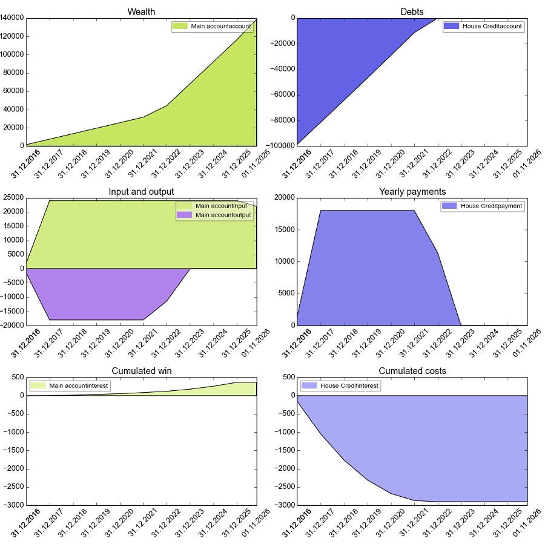
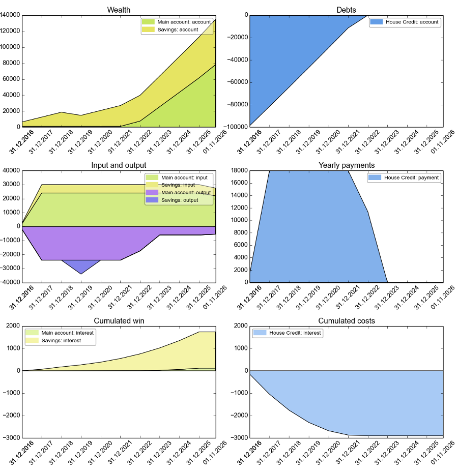
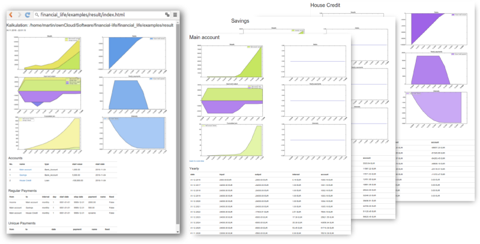

# financial-life
A framework for analysing financial products in personalized contexts

# Description

View [documentation](docs/README.md) for a more detailed introduction.

financial-life is an opinionated framework written in Python that allows to simulate monetary flows between different types of accounts. These simulations allow a deeper understanding of financial plans and a better comparison of financial products (in particular loan conditions) for personal circumstances.

financial_life was designed with the idea in mind that any line of code should contribute to the description of the problem you want to model. In spreadsheets, you would deal with a lot of auxiliary tables to accurately calculate the course of a loan influenced by incoming payments and generated interests. In financial_life, you just create your loan account with the given interests rate and you define the regular payments going into this loan account. That's it. Changes in the model and the exploration of different parameters within this model are therefore way easier to accomplish than in a spreadsheet-based simulation.

# Usage
Say you want to model an account with regular income and payments to a loan

```python
from financial_life.financing import accounts as a
from datetime import timedelta, datetime

# create a private bank account and a loan account
account = a.Bank_Account(amount = 1000, interest = 0.001, name = 'Main account')
loan = a.Loan(amount = 100000, interest = 0.01, name = 'House Credit')

# add these accounts to the simulation
simulation = a.Simulation(account, loan)

# describe single or regular payments between accounts. note, that
# a string can be used for external accounts that you don't want to model.
simulation.add_regular('Income', account, 2000, interval = 'monthly')
# you can also use lambda function to dynamically decide how much money
# you would like to transfer
simulation.add_regular(account, loan, lambda: min(1500, -loan.account), interval = 'monthly')

# simulate for ten years
simulation.simulate(delta = timedelta(days=365*10))

# plot the data
simulation.plt_summary()

# print reports summarized in years
print(account.report.yearly())
print(loan.report.yearly())

# analyze data
print("Interests on bank account: %.2f" % sum(account.report.yearly().interest))
print("Interests on loan account: %.2f" % sum(loan.report.yearly().interest))
```  

The output will look like this one:




	Main account
	Date          account     output     input    interest
	----------  ---------  ---------  --------  ----------
	31.12.2016    2000.32   -3000.00   4000.00        0.32
	31.12.2017    8005.58  -18000.00  24000.00        5.26
	31.12.2018   14016.85  -18000.00  24000.00       11.27
	31.12.2019   20034.13  -18000.00  24000.00       17.28
	31.12.2020   26057.42  -18000.00  24000.00       23.29
	31.12.2021   32086.74  -18000.00  24000.00       29.32
	31.12.2022   46271.00   -9853.30  24000.00       37.56
	31.12.2023   70330.32       0.00  24000.00       59.32
	31.12.2024   94413.68       0.00  24000.00       83.36
	31.12.2025  118521.15       0.00  24000.00      107.47
	01.10.2026  138521.15       0.00  20000.00        0.00
	House Credit
	Date          account    interest    payment
	----------  ---------  ----------  ---------
	31.12.2016  -97190.22     -190.22    3000.00
	31.12.2017  -80064.23     -874.01   18000.00
	31.12.2018  -62766.98     -702.75   18000.00
	31.12.2019  -45296.76     -529.78   18000.00
	31.12.2020  -27652.02     -355.26   18000.00
	31.12.2021   -9830.65     -178.63   18000.00
	31.12.2022       0.00      -22.65    9853.30
	31.12.2023       0.00        0.00       0.00
	31.12.2024       0.00        0.00       0.00
	31.12.2025       0.00        0.00       0.00
	Interests on bank account: 374.45
	Interests on loan account: -2853.30

Now let's say, we put some money on a special savings account with better interests, because we want to purchase in two years a car. With financial_life, you just add the necessary changes to your model.

```python
# create new account
savings = a.Bank_Account(amount = 5000, interest = 0.007, name = 'Savings')

# add it to the simulation (or create a new simulation with all three accounts)
simulation.add_account(savings)

# add regular payment to the savings-account
simulation.add_regular(account, savings, 500, interval = 'monthly')

# somewhere in the distant future we will make a payment to
# the vendor of a car
simulation.add_unique(savings, 'Vendor of a car', 10000, '17.03.2019')
```

The plot will now include the savings-account as well.



You can also export the simulation to HTML to explore your model in the browser:

```python
from financial_life.reports import html

cwd = os.path.dirname(os.path.realpath(__file__))
result_folder = cwd + '/result'

html.report(simulation, style="standard", output_dir = result_folder)
```



# Installation

financial_life has been written in Python 3.4 and has not  been tested for Python 2.x.

To get a working environment, simply do

	git clone https://github.com/MartinPyka/financial_life.git
	cd financial_life
	virtualenv venv
	source venv/bin/activate
	pip install -r requirements.txt

For installing the package:

	git clone https://github.com/MartinPyka/financial_life.git
	cd financial_life
	python setup.py install

Or use pip

 	pip install financial_life

You can checkout the example with

	python financial_life/examples/simple_examples.py
