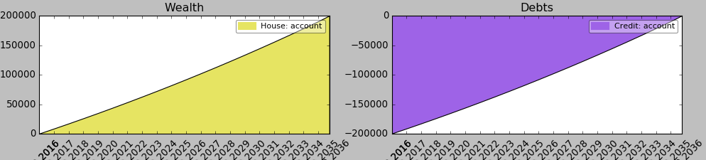

# Dependencies between accounts

Modeling loan accounts can be helpful to calculate payment durations and interests costs. But modeling them alone, does not reflect the accumulation of asset that one gains by decreasing the amount of debts. For example, if you start a loan in order to buy a house, you would like to take into account that the value of the house is more and more part of your asset the more you decrease the loan. This means, there is a dependency between the loan you pay and the value of the house that belongs to your asset.

In fl, there is a class `Property` in order to model this relationship. And it can be used in the following way:

```python
loan = a.Loan(200000, 0.0185, name = 'Credit' )
house = a.Property(200000, 0, loan, name='House')
```

You create a new object of type `Property`, in which you state the value of the property, the amount of own capital you put into it, and the loan account on which it depends. When during the simulation, the loan goes down, the property will go up.



Here is the [example code](../financial_life/examples/dependencies.py)

The class `Property` is defined in the following way:

```python
class Property(Account):
    """
    This class can be used to reflect the amount of property that is gained
    from filling up a loan. This account does nothing else than adjusting the
    amount of property depending on the payments transfered to the loan class
    """

    def __init__(self, property_value, amount, loan, date = None, name = None):
```

<table>
  <tr>
    <th>
      Keyword Argument
    </th>
    <th>
      Description
    </th>
  </tr>
  <tr>
    <td>
      property_value
    </td>
    <td>
      The value of the property.
    </td>
  </tr>
  <tr>
    <td>
      amount
    </td>
    <td>
      The amount of money that is already part of the own property.
    </td>
  </tr>
  <tr>
    <td>
      loan
    </td>
    <td>
      A loan object to which a dependency is created.
    </td>
  </tr>
  <tr>
    <td>
      date
    </td>
    <td>
      The date, when this account should exist. Before this date, the account will not be simulated. For quick simulation, where this nuance is not relevant, this field can be left empty. As date, datetime and strings in the format '%d.%m.%y', '%m/%d/%Y' are accepted.
    </td>
  </tr>
  <tr>
    <td>
      name
    </td>
    <td>
      Simply a string representation of the property id. If empty, fl will create a random string sequence.
    </td>
  </tr>
</table>
